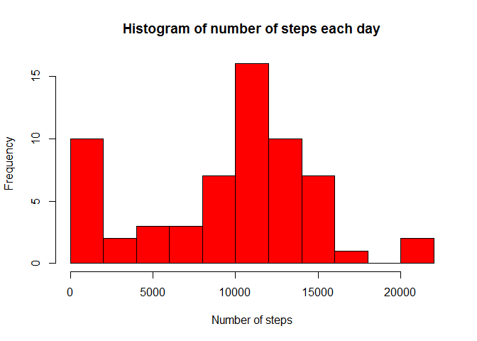
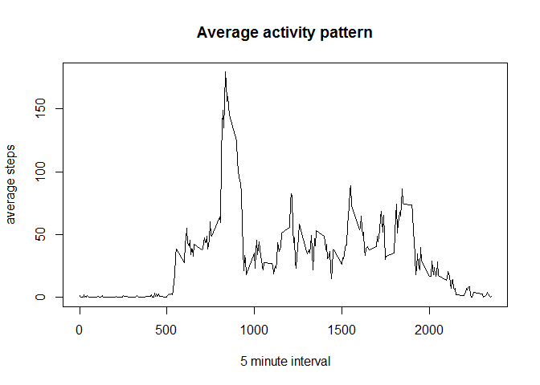
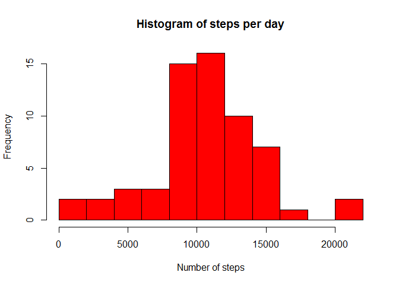
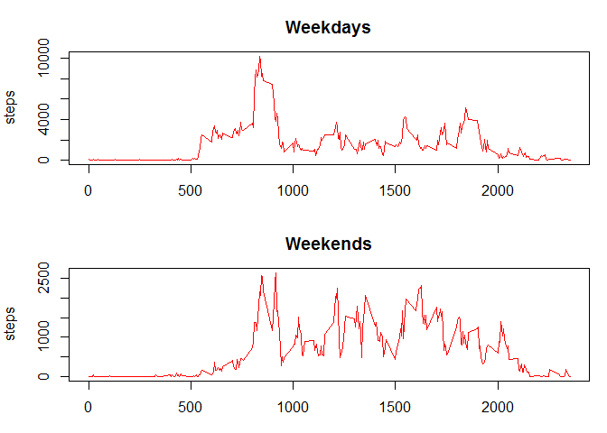

Reproducible Research Assignment 1
=========================================================
Some inital settings

```r
library(dplyr)
```

```
## 
## Attaching package: 'dplyr'
## 
## The following object is masked from 'package:stats':
## 
##     filter
## 
## The following objects are masked from 'package:base':
## 
##     intersect, setdiff, setequal, union
```

```r
Sys.setlocale("LC_TIME", "C")
```

```
## [1] "C"
```
Here the data is read

```r
tb <- read.csv("activity.csv",header=T)
```

This is a histogram for the total number of steps per day

```r
per_date <- group_by(tb,date)
per_date <- summarise(per_date,steps=sum(steps,na.rm=T))
hist(per_date$steps,breaks=15,col='red',main="Histogram of number of steps each day",xlab='Number of steps')
```

 
This is the mean of the total number of steps taken per day

```r
mean(per_date$steps)
```

```
## [1] 9354.23
```
This is the median of the total number of steps taken per day

```r
median(per_date$steps)
```

```
## [1] 10395
```
Here the average number of steps per interval is calculated and plotted

```r
per_interval <- group_by(tb,interval)
per_interval <- summarise(per_interval,steps = sum(steps,na.rm=T))
per_interval$steps <- per_interval$steps/length(per_date$date)
plot(per_interval$interval,per_interval$steps,type='l',xlab="5 minute interval",ylab="average steps",main = "Average activity pattern")
```

 

This 5-minute interval, on average across all the days in the dataset, contains the maximum number of steps.

```r
per_interval[per_interval$steps==max(per_interval$steps),1]
```

```
## Source: local data frame [1 x 1]
## 
##   interval
## 1      835
```

Number of missing values is

```r
sum(is.na(tb$steps))
```

```
## [1] 2304
```
This code creates a data set were the NAs have been replaced with the mean for that 5 minute interval

```r
New_tb <- tb
for(k in 1:length(tb$steps)){
        if(is.na(tb$steps[k])){
          New_tb$steps[k] <- per_interval[per_interval$interval==tb$interval[k],2]
          }
}
```
This will summarize and plot the histogram for the number of steps taken per date, with missing values imputed

```r
New_tb_date <- group_by(New_tb,date)
New_tb_date <- summarize(New_tb_date,steps = sum(as.numeric(steps)))
hist(New_tb_date$steps,breaks = 15,col='red',main = "Histogram of steps per day",xlab="Number of steps")
```

 


This is the mean number of steps taken per day

```r
mean(New_tb_date$steps)
```

```
## [1] 10581.01
```
This is the median number of steps taken per day

```r
median(New_tb_date$steps)
```

```
## [1] 10395
```

This adds the new variable day indicating whether a given date is a weekday or weekend day

```r
New_tb_interval <- group_by(New_tb,interval)
New_tb_interval$steps <- as.numeric(New_tb_interval$steps)
New_tb_interval <- New_tb_interval %>%mutate(day = ifelse(weekdays(as.Date(New_tb_date$date))=='Saturday'|weekdays(as.Date(New_tb_date$date))=='Sunday','Weekend','Weekday'))
```

This creates and plots two new data sets,for weekdays and weekends, with average number of steps taken per 5 minute interval.

```r
 day_data <- New_tb_interval[as.vector(New_tb_interval[,4]=="Weekday"),]
 end_data <- New_tb_interval[as.vector(New_tb_interval[,4]=="Weekend"),]
 
 day_data <- summarise(day_data,steps=sum(steps))
 end_data <- summarise(end_data,steps=sum(steps))
par(mar=c(3,4,3,1))
par(mfrow=c(2,1))
plot(day_data$interval,day_data$steps/(length(day_data$steps)/288),type='l',col="red",main="Weekdays",xlab="Interval",ylab="steps")
plot(end_data$interval,end_data$steps/(length(end_data$steps)/288),type='l',col="red",main="Weekends",xlab="Interval",ylab="steps")
```

 

